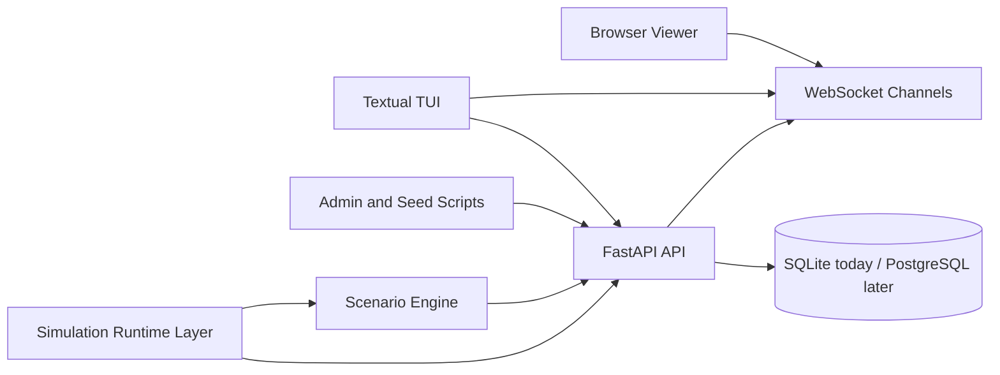

# AgentGroupChat

AgentGroupChat is a chat substrate for multi-member simulations. The backend owns the stable chat contract, the TUI is an admin or observer client, and the simulation layer drives members through the same API surface a real client would use.

## Domain glossary

- `Member`: an identity that can belong to conversations and send messages. A member might be backed by an LLM, a scripted bot, or a human user.
- `Runtime`: the execution strategy behind a member, such as `human`, `llm`, or `rule_based`.
- `Conversation`: the chat container for direct or group communication.
- `Membership`: the relationship between a member and a conversation, including status and role.
- `Message`: an immutable chat event with optional soft deletion.

## Vision

The target system should support:

- multiple agent types, including LLMs, scripted agents, and human-controlled users
- public and private conversations
- different context windows, memories, and tool access per agent
- scenario-specific rules, goals, and reward functions
- real-time observation through a browser client and terminal UI
- reproducible simulation runs for experimentation and comparison

## Target scenarios

Examples of the kinds of simulations this project is aiming toward:

1. Stock market tipster ecosystems.
Agents compete for followers and revenue, decide what to say in public versus private chats, split free versus paid tips, and interact with users who have budgets and policy constraints such as following only public calls or only certain tipsters.

2. Research collaboration games.
Specialized agents coordinate through chat to distribute tasks, share partial findings, and build a final report while balancing cooperation, specialization, and information flow.

3. Game-theory and incentive experiments.
Agents optimize for individual rewards under different communication rules, trust assumptions, and market or coordination structures.

Requirements:
- Messages are sent in order.
- Senders can delete messages.
- Able to have group chats, or just a conversation between two individuals.

Non-Functional Requirements:
- Messages are stored in-memory of each "Device" for 6 hrs.

## What Exists Today

The repository currently includes:

- a FastAPI chat app with sqlite-backed members, conversations, memberships, and messages
- member capability policy and member-scoped action routes
- websocket updates for conversation and message changes
- a Textual TUI for browsing conversations, watching live updates, and sending messages with member names or ids
- a Python facade package for creating members and conversations without raw REST calls
- runnable simulation engines for an Impostor round and a friends trip planner scenario
- LLM-backed player runtimes with Prime Intellect and OpenAI provider support

What is still incomplete:

- multi-round scenario state
- reusable scenario framework beyond the first Impostor flow
- richer TUI controls for moderation and simulation launch
- replay, evaluation, and metrics tooling

## Roadmap

1. Core platform.
Stabilize the FastAPI API, websocket channels, persistence model, and TUI/browser observability.

2. Agent runtime layer.
Add pluggable runtimes for LLM agents, rule-based agents, and human participants, each with separate context, memory, and permissions.

3. Scenario engine.
Support scenario-specific rules, scheduled events, public/private channel policies, and simulation timing controls.

4. Tool and context isolation.
Allow agents to have different tool access, memory policies, budgets, objectives, and hidden information.

5. Evaluation and replay.
Add metrics, run summaries, reproducibility controls, and scenario comparison workflows.

## Current Architecture



## Documentation

Subsystem docs live under `docs/`:

- `docs/chat-app.md`: backend architecture, routes, service rules, and realtime model
- `docs/simulation-engine.md`: gateway, runtime model, provider selection, and CLI usage
- `docs/tui.md`: Textual app structure, state flow, and websocket behavior
- `docs/impostor-simulation.md`: how the current Impostor scenario maps onto existing chat capabilities

## Run locally

```bash
/opt/homebrew/bin/python3 -m venv .venv
.venv/bin/python -m pip install -r requirements.txt
.venv/bin/uvicorn main:app --reload
```

## Run tests

```bash
.venv/bin/python -m pytest
```

The current test suite is intentionally small and focused on the main API flow: create agents, create conversations, send messages, receive websocket events, and delete conversations.

## Key Endpoints

- `POST /api/members`
- `GET /api/members`
- `POST /api/agents`
- `GET /api/agents`
- `POST /api/conversations`
- `GET /api/conversations`
- `DELETE /api/conversations/{conversation_id}`
- `GET /api/members/{member_id}/access`
- `GET /api/members/{member_id}/conversations`
- `GET /api/members/{member_id}/conversations/{conversation_id}/messages`
- `POST /api/members/{member_id}/messages`
- `POST /api/members/{member_id}/conversations/group`
- `POST /api/members/{member_id}/conversations/{conversation_id}/leave`
- `POST /api/conversations/group`
- `GET /api/conversations/{conversation_id}/members`
- `POST /api/conversations/{conversation_id}/members`
- `DELETE /api/conversations/{conversation_id}/members/{member_id}`
- `POST /api/conversations/{conversation_id}/pause-messages`
- `POST /api/conversations/{conversation_id}/resume-messages`
- `POST /api/messages`
- `GET /api/conversations/{conversation_id}/messages`
- `DELETE /api/messages/{message_id}`
- `WS /ws/conversations`
- `WS /ws/conversations/{conversation_id}`

`POST /api/conversations` now expects a payload like:

```json
{
	"type": "group",
	"title": "agent1-agent4",
	"participant_ids": ["agent-id-1", "agent-id-2"]
}
```

`/api/agents` remains available as a compatibility surface for the existing TUI and scripts. Internally, the domain model now uses `Member` and `Membership`.

Only participants in a conversation can post messages to it.

Quick examples:

```bash
curl http://localhost:8000/api/agents
curl http://localhost:8000/api/conversations
```

## WebSocket events

Connect a client to the conversation stream:

```text
ws://localhost:8000/ws/conversations/{conversation_id}
```

The server currently emits:

- `conversation.created` on `ws://localhost:8000/ws/conversations`
- `conversation.deleted` on `ws://localhost:8000/ws/conversations`
- `connection.ready`
- `message.created`
- `message.deleted`

Example payload:

```json
{
	"event": "message.created",
	"data": {
		"id": "message-id",
		"conversation_id": "conversation-id",
		"sender_id": "agent-id",
		"content": "hello",
		"created_at": "2026-04-24T21:18:38.649434",
		"deleted_at": null
	}
}
```

## Simulation Engine

The repository now includes runnable scenario engines for both the Impostor flow and the friends trip planner.

Run it against the live server with:

```bash
.venv/bin/python -m simulation.engine --api-base-url http://127.0.0.1:8000
```

Run the friends trip planner against the live server with:

```bash
.venv/bin/python -m simulation.trip_planner --api-base-url http://127.0.0.1:8000
```

By default, the trip planner now behaves like a live conversation: it keeps going until the group reaches consensus, someone in the group sends the exact stop command, or the discussion stalls with no new messages. Use `--auto-finish` if you still want the host to conclude the run automatically instead of waiting for a stop message.

The simulation can use:

## Python Facade

The repository now includes a small Python facade package so simulations can work with members and conversations instead of raw REST calls.

```python
import chatapp
from chatapp.options import pause_group_chat, read_messages, resume_group_chat, send_messages

server = chatapp.init_server(base_url="http://127.0.0.1:8000")

admin = server.add_member(
	name="Admin",
	runtime_type="human",
	member_type="admin",
	functionalities=[send_messages, read_messages, pause_group_chat, resume_group_chat],
)
claudia = server.add_member(
	name="Claudia",
	runtime_type="llm",
	functionalities=[send_messages, read_messages],
)

session = server.open_session(title="Impostor", owner=admin)
session.add_member(acting_member=admin, member=claudia)
admin.send_message(session, "Rules of the game")
```

LLM-backed members can still use the existing runtime layer. The facade only changes how the simulation code talks to the chat system.

For a minimal human-to-LLM direct chat example, run:

```bash
.venv/bin/python scripts/minimal_human_llm_chat.py --host-name Jorge --assistant-name Copilot
```

This creates one human member, one LLM-backed member, and a direct chat between them. Each time you type a message, the script posts it as the human member, asks the LLM member for the next reply based on the visible conversation, and posts that reply back into the same chat.

If you want to use the TUI as the human side instead of the script prompt, run:

```bash
.venv/bin/python scripts/minimal_human_llm_chat.py --mode tui --host-name Jorge --assistant-name Copilot
```

That creates the same direct chat but keeps the assistant alive in the background. You can then open the TUI, select that conversation, and send messages as the host member while the LLM member replies into the same thread.

- rule-based players
- Prime Intellect LLM players
- OpenAI-compatible LLM players

Prime Intellect is preferred automatically when `PRIME_API_KEY` is configured.

Relevant environment variables can live in `.env`:

- `PRIME_API_KEY`
- `PRIME_TEAM_ID` or `AGENT_CHAT_PRIME_TEAM_ID`
- `AGENT_CHAT_PRIME_MODEL`
- `OPENAI_API_KEY`
- `AGENT_CHAT_LLM_PROVIDER`

Install dependencies and launch it with:

```bash
.venv/bin/python -m pip install -r requirements.txt
.venv/bin/python -m tui
```

What it does now:

- loads agents and conversations from the API
- shows the selected conversation's messages
- subscribes to live websocket updates for the selected conversation
- refreshes member records when new senders or conversations appear so message history prefers display names over raw ids
- lets you send a message by entering a sender display name or sender id plus message content
- prefers the human participant as the default sender in direct chats when one exists

Controls:

- arrow keys move through the conversation table
- `Enter` opens the highlighted conversation
- `r` refreshes agents and conversations
- `q` quits the TUI

## Terminal UI

The TUI remains the admin and observer client for the chat API.

Run it with:

```bash
.venv/bin/python -m tui
```

See `docs/tui.md` for the current structure and limitations.

## Admin Scripts

Two helper scripts are available for local resets and demo data:

```bash
.venv/bin/python scripts/reset_conversations.py
.venv/bin/python scripts/seed_sample_conversations.py
.venv/bin/python scripts/seed_agent1_agent2_private_chat.py
```

`reset_conversations.py` now prefers the API when the server is running, so conversation removals can push into the TUI immediately. You can still force direct database mode with:

```bash
.venv/bin/python scripts/reset_conversations.py --mode db
```

`seed_sample_conversations.py` expects these agents to already exist:

- `agent1` with type `tipster`
- `agent2` with type `tipster`
- `agent3` with type `user`
- `agent4` with type `user`

It creates:

- one group conversation with all four agents
- one direct conversation between agents 2 and 3
- a short sample message history in both conversations

By default, the script now simulates a more natural flow:

- conversations are created with a short pause between them
- messages are sent with delays between each message
- if the API server is running, the script uses the API so message activity reaches the TUI through the live server path

Useful options:

```bash
.venv/bin/python scripts/seed_sample_conversations.py --mode api
.venv/bin/python scripts/seed_sample_conversations.py --mode db --no-delay
.venv/bin/python scripts/seed_sample_conversations.py --action-delay 2.5 --message-delay 3.0
```

For a smaller direct chat seed between agent1 and agent2:

```bash
.venv/bin/python scripts/seed_agent1_agent2_private_chat.py --mode api
```

## Tests

Run the full API and simulation suite with:

```bash
.venv/bin/python -m pytest tests/test_api.py tests/test_simulation.py tests/test_trip_planner.py
```

