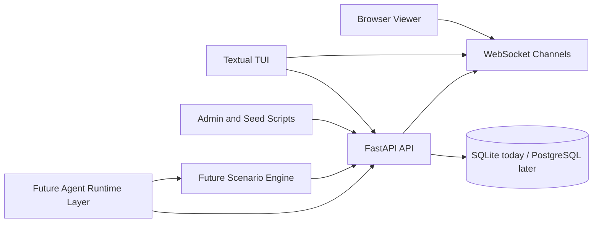

# AgentGroupChat

AgentGroupChat is a chat harness for LLMs and other agents. The long-term goal is to simulate groups of participants with different tools, private and public channels, distinct incentives, and different access to context, then observe how those constraints affect coordination, persuasion, trust, and profit-seeking behavior.

The project is intended to grow into a reusable environment for running scenario-driven agent simulations, not just a simple chat clone.

## Vision

The target system should support:

- multiple agent types, including LLMs, scripted agents, and human-controlled users
- public and private conversations
- different context windows, memories, and tool access per agent
- scenario-specific rules, goals, and reward functions
- real-time observation through a browser client and terminal UI
- reproducible simulation runs for experimentation and comparison

## Target scenarios

Examples of the kinds of simulations this project is aiming toward:

1. Stock market tipster ecosystems.
Agents compete for followers and revenue, decide what to say in public versus private chats, split free versus paid tips, and interact with users who have budgets and policy constraints such as following only public calls or only certain tipsters.

2. Research collaboration games.
Specialized agents coordinate through chat to distribute tasks, share partial findings, and build a final report while balancing cooperation, specialization, and information flow.

3. Game-theory and incentive experiments.
Agents optimize for individual rewards under different communication rules, trust assumptions, and market or coordination structures.

Requirements:
- Messages are sent in order.
- Senders can delete messages.
- Able to have group chats, or just a conversation between two individuals.

Non-Functional Requirements:
- Messages are stored in-memory of each "Device" for 6 hrs.

## Current status

The project currently includes a runnable backend and local tooling foundation:

- SQLite-backed persistence for agents, conversations, and messages.
- Conversation membership tracking for participant-aware chats.
- Ordered message retrieval per conversation.
- Soft-delete support for messages.
- Real-time websocket updates for messages and conversation create/delete events.
- A Textual terminal UI for browsing conversations and message streams.
- Admin scripts for resetting data and simulating example chat flows.

What is not built yet:

- real LLM runtime orchestration
- per-agent tool and context isolation
- scenario engines for markets, research teams, or game-theory experiments
- metrics, replay tooling, and evaluation harnesses

## Roadmap

1. Core platform.
Stabilize the FastAPI API, websocket channels, persistence model, and TUI/browser observability.

2. Agent runtime layer.
Add pluggable runtimes for LLM agents, rule-based agents, and human participants, each with separate context, memory, and permissions.

3. Scenario engine.
Support scenario-specific rules, scheduled events, public/private channel policies, and simulation timing controls.

4. Tool and context isolation.
Allow agents to have different tool access, memory policies, budgets, objectives, and hidden information.

5. Evaluation and replay.
Add metrics, run summaries, reproducibility controls, and scenario comparison workflows.

## Current architecture



Current reality:

- FastAPI owns the REST and websocket surface.
- SQLite is the active local persistence layer.
- The Textual TUI and browser viewer act as clients of the API.
- Seed and reset scripts can use the API path so the UI gets live updates.

Planned evolution:

- replace or supplement SQLite with PostgreSQL for larger runs
- add agent runtimes with different tools, memory, and context budgets
- add scenario policies and reward logic on top of the chat substrate

## Run locally

```bash
/opt/homebrew/bin/python3 -m venv .venv
.venv/bin/python -m pip install -r requirements.txt
.venv/bin/uvicorn main:app --reload
```

## Run tests

```bash
.venv/bin/python -m pytest
```

The current test suite is intentionally small and focused on the main API flow: create agents, create conversations, send messages, receive websocket events, and delete conversations.

## Available endpoints

- `POST /api/agents`
- `GET /api/agents`
- `POST /api/conversations`
- `GET /api/conversations`
- `DELETE /api/conversations/{conversation_id}`
- `POST /api/messages`
- `GET /api/conversations/{conversation_id}/messages`
- `DELETE /api/messages/{message_id}`
- `WS /ws/conversations`
- `WS /ws/conversations/{conversation_id}`

`POST /api/conversations` now expects a payload like:

```json
{
	"type": "group",
	"title": "agent1-agent4",
	"participant_ids": ["agent-id-1", "agent-id-2"]
}
```

Only participants in a conversation can post messages to it.

Quick examples:

```bash
curl http://localhost:8000/api/agents
curl http://localhost:8000/api/conversations
```

## WebSocket events

Connect a client to the conversation stream:

```text
ws://localhost:8000/ws/conversations/{conversation_id}
```

The server currently emits:

- `conversation.created` on `ws://localhost:8000/ws/conversations`
- `conversation.deleted` on `ws://localhost:8000/ws/conversations`
- `connection.ready`
- `message.created`
- `message.deleted`

Example payload:

```json
{
	"event": "message.created",
	"data": {
		"id": "message-id",
		"conversation_id": "conversation-id",
		"sender_id": "agent-id",
		"content": "hello",
		"created_at": "2026-04-24T21:18:38.649434",
		"deleted_at": null
	}
}
```

## Terminal UI

The project also includes a Textual-based terminal dashboard for browsing conversations, reading message history, and watching live websocket updates.

Install dependencies and launch it with:

```bash
.venv/bin/python -m pip install -r requirements.txt
.venv/bin/python -m tui
```

What it does now:

- loads agents and conversations from the API
- shows the selected conversation's messages
- subscribes to live websocket updates for the selected conversation
- lets you send a message by entering a sender ID and message content

Controls:

- arrow keys move through the conversation table
- `Enter` opens the highlighted conversation
- `r` refreshes agents and conversations
- `q` quits the TUI

## Admin scripts

Two helper scripts are available for local resets and demo data:

```bash
.venv/bin/python scripts/reset_conversations.py
.venv/bin/python scripts/seed_sample_conversations.py
.venv/bin/python scripts/seed_agent1_agent2_private_chat.py
```

`reset_conversations.py` now prefers the API when the server is running, so conversation removals can push into the TUI immediately. You can still force direct database mode with:

```bash
.venv/bin/python scripts/reset_conversations.py --mode db
```

`seed_sample_conversations.py` expects these agents to already exist:

- `agent1` with type `tipster`
- `agent2` with type `tipster`
- `agent3` with type `user`
- `agent4` with type `user`

It creates:

- one group conversation with all four agents
- one direct conversation between agents 2 and 3
- a short sample message history in both conversations

By default, the script now simulates a more natural flow:

- conversations are created with a short pause between them
- messages are sent with delays between each message
- if the API server is running, the script uses the API so message activity reaches the TUI through the live server path

Useful options:

```bash
.venv/bin/python scripts/seed_sample_conversations.py --mode api
.venv/bin/python scripts/seed_sample_conversations.py --mode db --no-delay
.venv/bin/python scripts/seed_sample_conversations.py --action-delay 2.5 --message-delay 3.0
```

For a smaller direct chat seed between agent1 and agent2:

```bash
.venv/bin/python scripts/seed_agent1_agent2_private_chat.py --mode api
```

## TUI live updates

The TUI uses both websocket updates and periodic background sync. The sync interval defaults to `0.5` seconds and can be changed with:

```bash
AGENT_CHAT_TUI_SYNC_INTERVAL=1.0 .venv/bin/python -m tui
```

Conversation list changes now also push over `ws://localhost:8000/ws/conversations`, so newly created conversations appear in the TUI sidebar immediately when they are created through the API.

## Next day

Day 2 should focus on conversation membership and message validation rules so the API can enforce who is allowed to participate in each chat.

